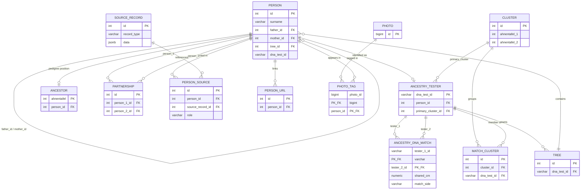

# Family Tree Database — Schema Reference

> Describes the schema produced by the Flyway migrations in `src/main/resources/db/migration/`
> (`V1__baseline.sql` … `V11__…`), as built into the local `familytree-postgres` Postgres 16.11 container
> and verified against that live database. There is no remote deployment yet — a Civo account exists but
> nothing is deployed to it. The migrations are the source of truth; this doc describes what they build.

## Overview

The database holds two related but distinct worlds, bridged in the middle:

1. **The genealogical core** — keyed on the integer `person.id`. This is the conventional tree: people, parents, partnerships, source records, photos. It knows nothing about DNA.
2. **The DNA / matching layer** — keyed on `ancestry_tester.dna_test_id` (a UUID-format `varchar(36)`). This is the Ancestry-scraped world: testers, the cM/segment matrix between them, and the clustering that groups them toward common ancestors.

The two are joined by a **soft, bidirectional bridge**:

- `ancestry_tester.person_id → person.id` ("this DNA match is this person in my tree")
- `person.dna_test_id` ("this person in my tree has taken this DNA test")

Both columns are nullable and neither is enforced against the other, so the two halves can drift out of agreement. See [Gotchas](#gotchas--things-to-revisit).

## Entity-relationship diagram



---

## Genealogical core

### `person`

The central table. Every individual in any tree — yours and scraped matches' trees — is a row here.

| Column | Type | Notes |
|---|---|---|
| `id` | `serial` PK | |
| `first_name`, `middle_names` | `varchar(500)` | |
| `surname`, `birth_surname` | `varchar(255)` | `birth_surname` = maiden name |
| `birth_date`, `death_date` | `date` | |
| `birth_year_approx`, `death_year_approx` | `integer` | approximate year when exact date unknown |
| `birth_place`, `death_place` | `varchar(255)` | |
| `gender` | `char(1)` | |
| `father_id`, `mother_id` | `integer` FK → `person.id` | self-referential; NULL if unknown. Labelled "first/second parent (typically father/mother)" |
| `dna_test_id` | `varchar(36)` | UUID, only if this person has tested. Bridge to the DNA layer |
| `tree_id` | `integer` FK → `tree.id` | which tree this person belongs to |
| `tree_person_id` | `bigint` | Ancestry's own numeric person ID from scraped trees |
| `avatar_path` | `varchar(255)` | |
| `notes` | `text` | free-form research notes |
| `created_at`, `updated_at` | `timestamp` | `updated_at` is insert-time only — see [Gotchas](#gotchas--things-to-revisit) #5 |

Indexes: `surname`, `father_id`, `mother_id`, partial on `dna_test_id`, `tree_id`, `tree_person_id` (the partials only index non-NULL rows).

### `partnership`

Marriages / couples. **Important quirk:** per the column comment, this is *for childless couples only* — couples who share children are linked implicitly through those children's `father_id`/`mother_id`. So to find a person's partner you sometimes look here and sometimes have to derive it from shared children. (See [Gotchas](#gotchas--things-to-revisit).)

| Column | Type | Notes |
|---|---|---|
| `id` | `serial` PK | |
| `person_1_id`, `person_2_id` | `integer` FK → `person.id` | |
| `marriage_date`, `marriage_date_approx`, `marriage_place` | | |

Unique on `(person_1_id, person_2_id)`.

### `tree`

A container for people — your own research trees and scraped Ancestry trees.

| Column | Type | Notes |
|---|---|---|
| `id` | `serial` PK | |
| `name`, `source`, `owner_name` | | |
| `match_person_id` | `integer` | the DNA match whose tree this is |
| `dna_test_id` | `varchar(36)` FK → `ancestry_tester.dna_test_id` | |
| `ancestry_tree_id` | `bigint` | Ancestry's numeric tree ID; NULL for your own trees |
| `size` | `integer` | denormalised person count (performance) |

### `source_record`

Genealogical evidence — census, BMD, probate, directories, newspapers, etc.

| Column | Type | Notes |
|---|---|---|
| `id` | `serial` PK | |
| `record_type` | `varchar(50)` | census / birth / marriage / death / probate / burial / phone_directory / newspaper / obituary … |
| `title`, `location`, `reference`, `url` | | |
| `record_date`, `record_date_approx` | | |
| `data` | `jsonb` | record-type-specific fields, schema-on-read. GIN-indexed. e.g. census `{household_id, occupation, relationship_to_head}`, probate `{effects_value, executor}` |

### `person_source`

The many-to-many join between people and evidence, with provenance.

| Column | Type | Notes |
|---|---|---|
| `id` | `serial` PK | |
| `person_id` | FK → `person.id` | |
| `source_record_id` | FK → `source_record.id` | |
| `role` | `varchar(50)` | how the person appears: subject / spouse / parent / child / witness / executor / mentioned / head_of_household |
| `confidence` | `varchar(20)` | certain / probable / possible / speculative |

Unique on `(person_id, source_record_id, role)`.

### `person_url`

External links per person (free-form). FK → `person.id`.

### `photo` and `photo_tag`

`photo` holds image metadata (`id bigint`, `original_filename`, `description`, `year_taken`, `uploaded_at`). `photo_tag` is the face-tagging join: composite PK `(photo_id, person_id)` plus `x_position`/`y_position` (normalised coordinates of the face in the image). `photo_tag.photo_id` is the **only FK in the schema with `ON DELETE CASCADE`** — deleting a photo cleans up its tags; everything else is `RESTRICT`.

---

## DNA / matching layer

### `ancestry_tester`

Everyone who has taken an Ancestry DNA test — you, and every match you've scraped.

| Column | Type | Notes |
|---|---|---|
| `dna_test_id` | `varchar(36)` PK | Ancestry DNA test GUID |
| `name` | `varchar(500)` | display name of the match |
| `source` | `varchar(50)` | default `'ancestry'` |
| `admin_level` | `integer` | 0=viewer, 1=contributor, 2=editor, 3=manager, 4=owner |
| `has_tree`, `tree_size`, `generation_depth` | | |
| `person_id` | `integer` FK → `person.id` | set once the match is identified in the tree |
| `primary_cluster_id` | `integer` FK → `cluster.id` | the cluster used for MRCA display |
| `avatar_path` | | |

### `ancestry_dna_match`

The pairwise cM/segment matrix. Holds **both** your own matches *and* the shared-match relationships between your matches (the in-common-with data).

| Column | Type | Notes |
|---|---|---|
| `tester_1_id`, `tester_2_id` | `varchar(36)` | composite PK; both FK → `ancestry_tester.dna_test_id` |
| `shared_cm` | `numeric(8,3)` | |
| `shared_segments` | `integer` | |
| `predicted_relationship` | `varchar(100)` | |
| `match_side` | `varchar(20)` | paternal / maternal / both / unknown — only meaningful for *your* direct matches |

Two key constraints make this table work:

- **`CHECK (tester_1_id < tester_2_id)`** — enforces canonical ordering of the pair, so the A↔B relationship is stored exactly once rather than as both A-B and B-A. Any code inserting here must sort the two IDs first.
- **`CHECK (match_side IN ('paternal','maternal','both','unknown'))`**.

### `cluster`

A cluster of matches that descend from a common ancestral couple, anchored to **positions in your own pedigree** via ahnentafel numbers.

| Column | Type | Notes |
|---|---|---|
| `id` | `serial` PK | |
| `name`, `notes` | | |
| `ahnentafel_1` | `integer` | first common ancestor (your ahnentafel number); NULL if undetermined |
| `ahnentafel_2` | `integer` | the spouse of `ahnentafel_1`, for full relationships; NULL for half-relationships or unknown |

### `match_cluster`

Join table placing testers into clusters (a tester can belong to several).

| Column | Type | Notes |
|---|---|---|
| `id` | `serial` PK | |
| `cluster_id` | FK → `cluster.id` | |
| `dna_test_id` | `varchar(36)` FK → `ancestry_tester.dna_test_id` | **nullable**, no uniqueness — see Gotchas |

### `ancestor`

Maps **your** pedigree to person records. One row per ahnentafel position.

| Column | Type | Notes |
|---|---|---|
| `ahnentafel` | `integer` PK | 1=you, 2=father, 3=mother, 4=paternal grandfather … |
| `person_id` | `integer` FK → `person.id`, UNIQUE | |

This is what gives `cluster.ahnentafel_1/2` meaning: a cluster points at ahnentafel slots, and `ancestor` resolves those slots to actual people.

---

## View

### `my_dna_matches`

A convenience view that flattens `ancestry_dna_match` down to *your* matches only. It filters the pair table to rows containing your test ID, then `CASE`s out the "other" tester so each row reads as "you ↔ this match," joins `ancestry_tester` for their details, and orders by `shared_cm DESC`.

⚠️ **Your DNA test GUID (`e756de6c-…`) is hard-coded into the view definition** in three places. See Gotchas.

---

## Migrations

Managed by **Flyway** (`flyway_schema_history` table present). To see the applied lineage:

```sql
SELECT version, description, type, success, installed_on
FROM flyway_schema_history
ORDER BY installed_rank;
```

Because this is managed Postgres with hand-run migrations, treat this live dump — not the `V*.sql` files — as the source of truth, and reconcile the two periodically.

---

## Gotchas / things to revisit

These are observations worth a decision, not necessarily bugs:

1. **Hard-coded owner GUID in `my_dna_matches`.** The view embeds your test ID three times. If it ever changes, or you want the view reusable for another root tester, this breaks. Options: a single-row `config`/`settings` table the view joins to, or replace the view with a function taking the root tester ID as a parameter.

2. **The person ↔ tester bridge is unenforced and bidirectional.** Nothing guarantees that if `ancestry_tester.person_id = 42` then `person 42`'s `dna_test_id` points back. The two columns can disagree. Worth a periodic consistency check, or picking one direction as canonical and deriving the other.

3. **`partnership` is "childless couples only."** This is a real modelling fork: partner-of is sometimes in `partnership`, sometimes implied by shared children. Any "who was X married to" query has to handle both paths. Fine as a deliberate choice — just make sure it's documented at the query layer too, because it's the kind of thing that silently bites six months later.

4. **`match_cluster` has no unique constraint** on `(cluster_id, dna_test_id)` and its `dna_test_id` is nullable. A tester can be added to the same cluster twice, and a row can exist with no tester at all. If the intent is "a tester is in a cluster at most once," add `UNIQUE (cluster_id, dna_test_id)` and `NOT NULL`.

5. **`updated_at` columns don't auto-update.** Several tables have `updated_at DEFAULT CURRENT_TIMESTAMP`, but that only fires on INSERT. Without a trigger (or the app setting it explicitly on every UPDATE), `updated_at` will equal `created_at` forever. Either add a `BEFORE UPDATE` trigger or accept that the column is insert-time only and rename it to avoid the trap.

6. **Default `RESTRICT` on most FKs.** Only `photo_tag → photo` cascades. Deleting a `person` or `source_record` referenced elsewhere will be blocked — usually what you want for genealogy data, but worth knowing before you wonder why a delete fails.

---

## Table summary

| Table | Rows are | PK | Layer |
|---|---|---|---|
| `person` | individuals | `id` | core |
| `partnership` | childless couples | `id` | core |
| `tree` | trees (own + scraped) | `id` | core |
| `source_record` | evidence documents | `id` | core |
| `person_source` | person↔source links | `id` | core |
| `person_url` | external links | `id` | core |
| `photo` | image metadata | `id` | core |
| `photo_tag` | face tags | `(photo_id, person_id)` | core |
| `ancestor` | your pedigree slots | `ahnentafel` | bridge |
| `ancestry_tester` | DNA testers | `dna_test_id` | DNA |
| `ancestry_dna_match` | pairwise cM matrix | `(tester_1_id, tester_2_id)` | DNA |
| `cluster` | match clusters | `id` | DNA |
| `match_cluster` | tester↔cluster links | `id` | DNA |
| `flyway_schema_history` | migration log | `installed_rank` | meta |
